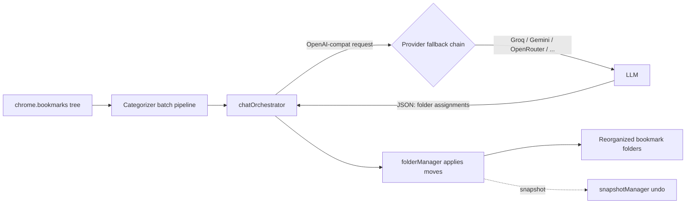

# BookmarkMind — AI Bookmark Organizer

> Auto-sort your browser bookmarks into intelligent, functional folders with any OpenAI-compatible LLM — bring your own key.

[](https://github.com/chirag127/bookmark-mind/actions/workflows/ci.yml)
[](./LICENSE)
[](https://github.com/chirag127/bookmark-mind/stargazers)
[](https://github.com/chirag127/bookmark-mind/commits/main)
[](./extension/manifest.json)

## What it is / why it exists

Browser bookmarks rot into a giant unsorted heap. Manual foldering is tedious, and cloud "smart" organizers want you to hand your links to their servers. **BookmarkMind** is a Manifest V3 browser extension that categorizes your existing bookmarks into a clean, functional folder tree using an LLM of *your* choice — 13 OpenAI-compatible providers built in, or any custom endpoint. No server, no telemetry: your links only leave the device when you click "Categorize", and only to the provider you configured with your own key.

## Links

- **Live site:** [bookmark-mind.oriz.in](https://bookmark-mind.oriz.in) (Cloudflare Pages)
- **GHP landing:** https://chirag127.github.io/bookmark-mind/
- **Repo:** https://github.com/chirag127/bookmark-mind
- **Chrome Web Store:** listing pending — v1.2.0 in the submission queue. Until then, [load unpacked](#install) from source.

⭐ **If this is useful, please star the repo — it helps others find it.**

## How it works



## Highlights

- **13 built-in providers** — Groq, Cerebras, Google Gemini, OpenRouter, Mistral, HuggingFace, DeepSeek, OpenAI, Novita + localhost providers (LM Studio, Ollama, LiteLLM, OmniRoute)
- **Custom provider** — add any OpenAI-compatible HTTPS endpoint (self-hosted vLLM, corporate proxy, niche vendor)
- **Fallback ordering** — drag providers to prioritize; automatic 5-min cool-off on HTTP 429
- **Encrypted key storage** — AES-256-GCM before writing to `chrome.storage.sync`
- **FMHY-style folders** — categorizes by what services DO ("Tools > File Tools > Cloud Storage") not by provider ("Google > Drive")
- **Zero telemetry** — no server, no analytics, no phone-home. Source at [chirag127/bookmark-mind](https://github.com/chirag127/bookmark-mind).

## Install

**From Chrome Web Store**: (pending listing — v1.2.0 in submission queue)

**From source** (unpacked):

1. `git clone https://github.com/chirag127/bookmark-mind.git`
2. Open Chrome → `chrome://extensions/` → toggle **Developer mode** (top-right)
3. Click **Load unpacked** → select the `extension/` directory
4. Icon appears in toolbar — click to open the popup

Or download the latest release ZIP from [releases](https://github.com/chirag127/bookmark-mind/releases) and drag it onto `chrome://extensions/`.

## Providers

> Table auto-generated from `extension/lib/providers/registry.js`. Run `npm run docs` to regenerate.

<!-- BEGIN-AUTOGEN:PROVIDERS -->
| Provider | Tier | Base URL | Notes |
|---|---|---|---|
| Groq | 🎁 Permanent free | `https://api.groq.com/openai/v1` | 30 RPM, 500K tokens/day. No card. Fastest inference in fleet. |
| Cerebras | 🎁 Permanent free | `https://api.cerebras.ai/v1` | 1M tokens/day, 30 RPM, no card. 8K context cap on free tier. |
| Google Gemini | 🎁 Permanent free | `https://generativelanguage.googleapis.com/v1beta/openai` | Free tier, no card. Not available in EU/UK/CH. Prompts train models. |
| OpenRouter | 🎁 Permanent free | `https://openrouter.ai/api/v1` | Aggregator. 20+ :free models. 20 RPM / 50 RPD free, 1K RPD with $10 credit. |
| Mistral (Experiment) | 🎁 Permanent free | `https://api.mistral.ai/v1` | Experiment plan: 1 RPS, 500K TPM. Prompts train Mistral unless opted out. |
| HuggingFace Router | 🎁 Permanent free | `https://router.huggingface.co/v1` | Free tier included with HF account. Cold starts can be 30s+. |
| Novita | ⏳ Trial credits | `https://api.novita.ai/v3/openai` | $0.50 signup credits, 60 RPM. 120+ models. |
| DeepSeek | ⏳ Trial credits | `https://api.deepseek.com/v1` | 5M tokens on signup, 30 days. Card required past trial. |
| OpenAI | ⏳ Trial credits | `https://api.openai.com/v1` | Trial credits inconsistent by region. Card required past trial. |
| LM Studio (localhost) | 🏠 Localhost | `http://localhost:1234/v1` | Runs local models. Start LM Studio server first. No key needed. |
| Ollama (localhost) | 🏠 Localhost | `http://localhost:11434/v1` | Local models via Ollama. Set OLLAMA_ORIGINS=chrome-extension://* env var. |
| LiteLLM Proxy | 🔑 BYOK | `http://localhost:4000/v1` | Route to any provider via self-hosted LiteLLM proxy. Edit baseUrl. |
| OmniRoute (localhost) | 🏠 Localhost | `http://localhost:20128/v1` | 60+ free models routed via local OmniRoute dev server. No key needed. |
<!-- END-AUTOGEN:PROVIDERS -->

**Tier legend**: 🎁 permanent free (no card) · ⏳ trial credits · 🔑 bring-your-own-key · 🏠 localhost

## Configuration

1. Click the BookmarkMind icon → **Options** (or right-click → Options)
2. Under **AI Providers**, click **+ Add Provider** and pick a preset, or **+ Custom** for any OpenAI-compat URL
3. Paste your API key (or leave blank for localhost) → **Save** → **Test** to verify
4. Click **↻ Refresh models** to populate the model dropdown
5. Drag providers to reorder — top = tried first, fallback on rate limit
6. Return to the popup → **Categorize All Bookmarks**

Full docs: [`docs/PROVIDERS.md`](./docs/PROVIDERS.md)

## Publishing to Chrome Web Store

See [`docs/PUBLISHING.md`](./docs/PUBLISHING.md) for the step-by-step. Uses the ZIP built by `npm run package`.

Listing copy, permission justifications, privacy policy: [`docs/CWS-LISTING.md`](./docs/CWS-LISTING.md), [`docs/PRIVACY.md`](./docs/PRIVACY.md).

## Development

```bash
git clone https://github.com/chirag127/bookmark-mind.git
cd bookmark-mind
pnpm install                  # or npm install
pnpm test                     # runs the provider registry + adapter + keyStore tests
pnpm run check                # biome lint + format
pnpm run package              # builds dist/bookmarkmind-v<version>.zip for CWS
pnpm run docs                 # regenerates docs from registry.js
pnpm run screenshots          # captures CWS listing screenshots via headless Chrome
```

### Architecture

```
extension/
├── manifest.json               # MV3, host_permissions: <all_urls>
├── lib/providers/
│   ├── registry.js             # 13-provider catalog (source of truth)
│   ├── adapter.js              # OpenAI-compat request builder + response normalizer
│   ├── keyStore.js             # AES-GCM key encryption in chrome.storage.sync
│   ├── modelDiscovery.js       # /models cache in chrome.storage.local, 24h TTL
│   └── README.md
├── features/ai/
│   ├── chatOrchestrator.js     # provider fallback + rate-limit cool-off + JSON-mode helper
│   ├── aiProcessor.js          # Categorizer-facing API; delegates to chatOrchestrator
│   └── categorizer.js          # main batch pipeline
├── features/bookmarks/         # bookmark + folder + snapshot services
├── features/settings/          # settings-providers.js hooks up the new UI
└── features/core/background.js # MV3 service worker
```

### Adding a provider

Two paths:

1. **Built-in**: edit `extension/lib/providers/registry.js` and add a record. Then `npm run docs` to update the table everywhere. Tests in `tests/features/lib/providers/registry.test.js` auto-cover the count invariant.
2. **User custom**: use the "**+ Custom**" flow in Options — user enters ID, name, baseUrl, auth scheme, defaultModel. Runtime validation via `validateCustomProvider()`.

## Tech stack

- **Vanilla JavaScript (ES modules)**, Manifest V3 — no framework, no build step for the extension itself
- **Chrome Extensions APIs**: `bookmarks`, `storage`, `activeTab`, `tabs`, `notifications`, `alarms`
- **Biome** for lint/format · **Jest** (jsdom) for tests · **pnpm** workspace
- **Cloudflare Pages** for the marketing site (built by `scripts/build-site.mjs`)
- Targets Chrome 88+, Edge 88+, Brave, Opera

## Screenshots

_Screenshots pending — see [`docs/cws-assets/`](./docs/cws-assets) for the current promotional captures._

## Privacy

BookmarkMind has **no server** and **no telemetry**. Bookmark titles + URLs leave your device **only** when you explicitly click "Categorize" and only to the LLM provider you configured. Full policy: [`docs/PRIVACY.md`](./docs/PRIVACY.md).

## Part of the oriz family

BookmarkMind is one of ~80 small, single-purpose products in the **oriz** family. See the rest at [blog.oriz.in](https://blog.oriz.in).

## Cost

The marketing site runs **$0 on the Cloudflare free tier**. The extension is free and BYOK — your only cost is whatever your chosen LLM provider charges (most built-in providers have a permanent free tier).

## Status / roadmap

**Stable** (v1.2.0). In progress: Chrome Web Store listing, expanded folder-insights, per-provider model recommendations.

## License

MIT — see [`LICENSE`](./LICENSE).

## Author

Chirag Singhal · [chirag@oriz.in](mailto:chirag@oriz.in)

## Related

- [chirag127/workflows](https://github.com/chirag127/workflows) — the reusable GHA CI this repo uses
- [chirag127/OmniRoute](https://github.com/chirag127/OmniRoute) — the local aggregation proxy exposing 60+ free models (one of the 13 built-in providers)

---

_Conventional commits are the changelog — browse [the commit history](https://github.com/chirag127/bookmark-mind/commits/main) for what changed and when._
